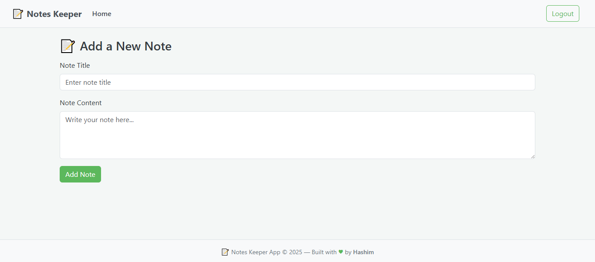

# 📝 Notes Keeper App

A full-stack web application that allows users to register, log in, and securely manage personal notes. Built with **Node.js**, **Express**, **MongoDB Atlas**, **EJS**, and styled using **Bootstrap** and **Vanilla CSS**. The project follows the **MVC architecture** and uses **RESTful APIs**.

---

## 👀 Preview

🔗 **Live App**: Test the live version [here](https://notes-keeper-hashim.vercel.app)

### Landing Page (Before Login)  
.png)  
*The landing page before user login.*

### Dashboard (After Login)  
.png)  
*User dashboard after login.*

### New Note Form  
  
*A structured form allowing users to create and save a new note.*


---

## 🚀 Features

- ✅ User registration and login with session-based authentication  
- 🔐 Only logged-in users can create, update, and delete their notes  
- ☁️ Connected to cloud database using **MongoDB Atlas**
- 📁 Organized MVC code structure  
- 🧠 RESTful API routes  
- 🎨 Clean UI with Bootstrap and CSS
- 🖥️📱 Fully responsive on all devices (mobile/desktop/tablet)
- 🌐 Deployed on Vercel

---

## 🛠️ Tech Stack

### Backend:
- Node.js  
- Express.js  
- express-session  
- MongoDB / MongoDB Atlas  

### Frontend:
- Bootstrap  
- Vanilla CSS  
- EJS (Embedded JavaScript Templates)  

### Architecture:
- MVC pattern (Model-View-Controller)  
- RESTful API design  

### Deployment:
- Vercel  

---

## 📁 Getting Started

### 1. Clone the repository

```bash
git clone https://github.com/047Hashim/notes-keeper-app.git
cd notes-keeper-app
```
### 2. Install dependencies
```bash
npm install
```

### 3. Set Up Environment Variables
Create a `.env` file in the root directory based on the provided `.env.example` file.
```env
# MongoDB connection URL (replace with your MongoDB Atlas URI or local URI)
ATLASDB_URL=your_mongo_atlas_connection_string

# Session secret key (used to sign session cookies)
SECRET=your_secret_key
```
💡 **Note**: If the `.env` file is not created, the app will fall back to default values defined in `app.js`:


> ```js
> const dbUrl = process.env.ATLASDB_URL || "mongodb://127.0.0.1:27017/test";
> const secretValue = process.env.SECRET || "mysecret_value";
> ```

### 4. Start the Application

```bash
node app.js
```
Then open your browser and visit [http://localhost:8080](http://localhost:8080) to view the app locally.

---

## 🧠 What I Learned

- **Developing** RESTful routes in Express **to handle note operations**
- **Implementing secure** user sessions with `express-session` **for authentication**
- **Architecting** an Express app using MVC **for maintainable code structure**
- **Establishing** database connections using **MongoDB Atlas**  
- **Designing** frontend interfaces with **Bootstrap** and **structuring** reusable **EJS** views  
- **Deploying** full-stack applications with **environment variables** on **Vercel**  

---

## 👤 Author

**Syed Hashim Naqvi**  
GitHub: [@047Hashim](https://github.com/047Hashim)


